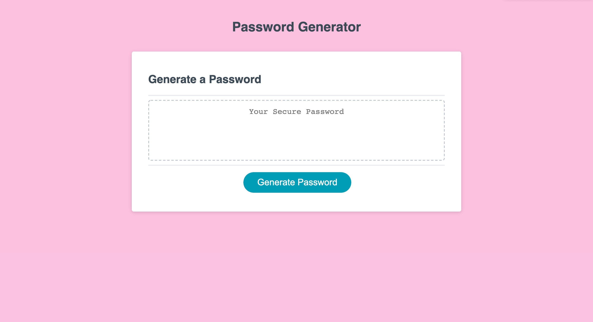

# Password Generator

## Description 📖 
This application allows users to randomly generate a strong password so that it provides greater security for sensitive data needing to be protected. 

### License 
This project is covered by the [MIT](https://choosealicense.com/) license.

## Contribution 🏆
Original code provided by the-[coding-bootcamp](https://github.com/coding-boot-camp/friendly-parakeet) and refactored by me.

## Links 🔗 
* [GitHub](https://github.com/MarisolRamirez1031/password-generator)
* [Deployed](https://marisolramirez1031.github.io/password-generator/) application.

## Visual 👀
